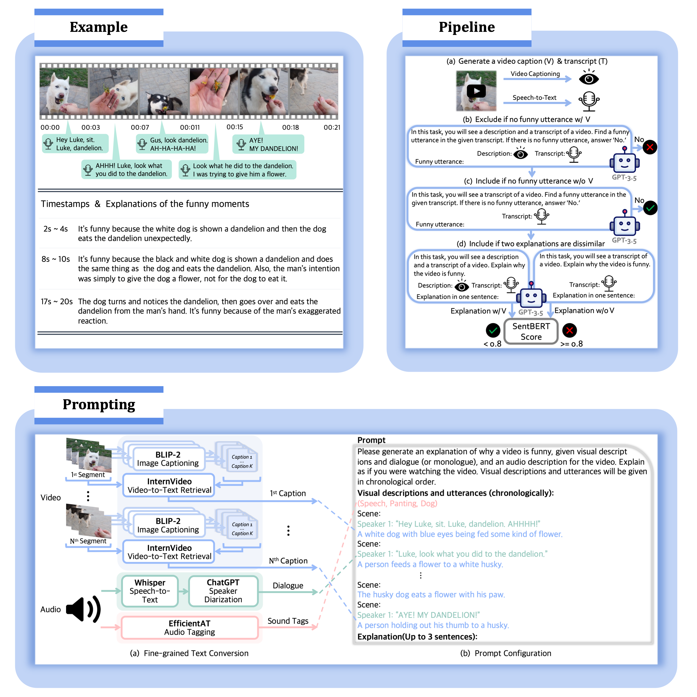

### Can Language Models Laugh at YouTube Short-form Videos? <a href="https://aclanthology.org/2023.emnlp-main.176.pdf">[EMNLP 2023] <a href="https://arxiv.org/abs/2310.14159">[ArXiv]</a>

#### ExFunTube Dataset &nbsp; <a href="https://exfuntube.github.io/">[Dataset Page]</a>
To evaluate whether LLMs can understand humor in videos, we collect user-generated, short-form funny videos from YouTube. It consists of 10,136 videos annotated with start and end timestamps of funny moments and corresponding explanations.<br/>  

#### How to make LLMs watch and explain funny videos?
Since black-box LLMs can be given only text, we have to convert videos into text form. For this, we devise a zero-shot video-to-text prompting framework. We divide the video into visual and audio, and audio is further split into transcript and sound tags. To gather video information from three different components, we use SOTA models in a zero-shot manner. And then, we configure prompts with gathered texts.<br/>  


   


#### Usage

##### To run filter pipeline:

```bash
$ cd pipeline
$ conda env create --file environment.yaml
$ pip install git+https://github.com/openai/CLIP.git
$ python run_pipeline.py --video_ids {video_id_file_name}
```

##### To run prompting:

```bash
$ cd prompting
$ conda env create --file environment.yaml
$ pip install git+https://github.com/openai/CLIP.git
$ python run_prompting.py
```


#### Citation
```bib
@inproceedings{ko-etal-2023-language,
    title = "Can Language Models Laugh at {Y}ou{T}ube Short-form Videos?",
    author = "Ko, Dayoon  and
      Lee, Sangho  and
      Kim, Gunhee",
    booktitle = "Proceedings of the 2023 Conference on Empirical Methods in Natural Language Processing",
    year = "2023",
    address = "Singapore",
    publisher = "Association for Computational Linguistics",
    url = "https://aclanthology.org/2023.emnlp-main.176/",
    doi = "10.18653/v1/2023.emnlp-main.176",
    pages = "2897--2916",
}
```
